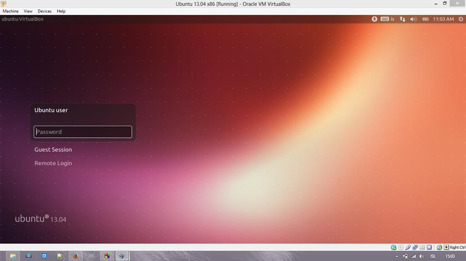

#Open Source

Hér á að koma listi af hópmeðlimum (sjá Markdown leiðbeiningar um það hvernig búa á til lista).
<ul>
   <li> Heiðar Freyr Steinunnarson</li>
</ul>

##  Linux uppsetning

Lýsið hvernig gekk að setja upp Linux (Ubuntu eða aðra útgáfu). Bætið inn í þetta skjal ljósmynd af tölvunni að ræsa Linux (skoðið hvernig myndir eru settar inn í Markdown skjöl).

það gekk bara mjög vel náði í dótið virtualboxi og ubuntu frá link
  og tvíklikkaði a ubuntu dótið það setti sig sjálft eigilega upp eina 
  sem ég þurfti að gera var að af klikka í usb2 í stillingum á
   virtualboxi þá var það komið  

## 2. Uppsetning á vim && git

Lýsið hvernig gekk að setja upp þessi tól.

notaði leiðbeintingar á verkefninu og það gékk mjög vel 
setti in leyniorðið þegar það var biðið um og svo einu sinni að samþykka 

## 3. Unnið með Git (1. hluti)

Lýsið hvernig gekk að forka NIM verkefnið, og hvernig gekk að láta hópmeðlimi gera hver sína breytingu á kóðanum.

Látið fylgja tengil á ykkar útgáfu af verkefninu (Það á að sjálfsögðu að vera hægt að smella á tengilinn og fara þá beint í verkefnið ykkar!)

Þurfti að reyna 3 áður en allt gekk smurt finna hvar á skellinni eg urfti að vera til að skipaninar virkuðu 

Slóð <a href="https://github.com/Hfreyr/INTOPrufa " title="HFreyr">
linkur hérna</a>.

## 4. Uppsettur hugbúnaður

Hér á að koma listi yfir opinn hugbúnað sem þið eruð með á vélunum nú þegar (sjá verkefnislýsingu).

## 5. Unnið með Git (2. hluti)
Hér þarf ekkert að gera annað en að setja niðurstöður úr 4. fyrstu liðunum inn í þetta skjal.
